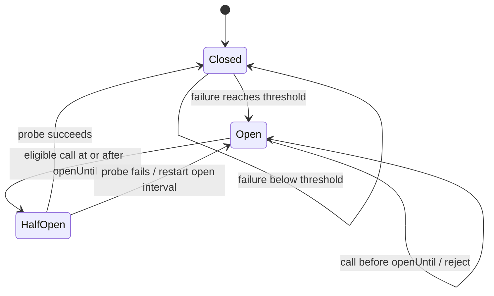
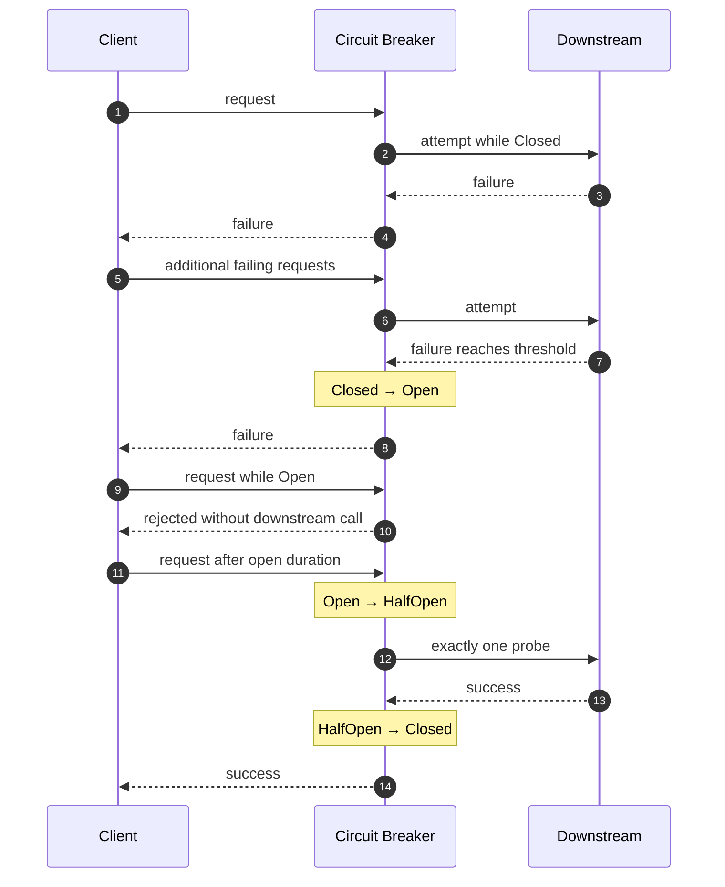
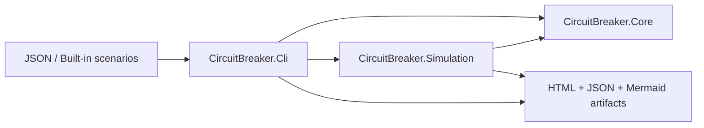

# circuit-breaker-state-machine

A deterministic .NET 10 laboratory for understanding the circuit breaker as a state machine rather than as “retry with a delay.”

## Learning goals

This repository demonstrates:

- `Closed`, `Open`, and `HalfOpen` state semantics;
- fail-fast rejection while a dependency is considered unhealthy;
- consecutive-failure tripping;
- deterministic recovery probing;
- the exactly-one-probe `HalfOpen` invariant;
- the difference between attempted failures and rejected calls;
- avoided downstream load during an outage;
- recovery latency introduced by the open interval;
- why retry and circuit breaking solve different problems.

## State machine



## Request behavior



## Architecture



## MVP scope

The MVP intentionally excludes retry, timeout, bulkhead, rate limiting, HTTP integration, distributed state, adaptive thresholds, and sliding-window failure ratios.

The failure policy is intentionally simple: **N consecutive failed attempts open the breaker**.

## Projects

- `CircuitBreaker.Core` — breaker state machine and public result model.
- `CircuitBreaker.Simulation` — deterministic requests, fake downstream availability, events, metrics, and scenario execution.
- `CircuitBreaker.Cli` — scenario selection, JSON loading, console summary, Mermaid export, and standalone HTML report export.
- `CircuitBreaker.Core.Tests` — exact state-transition and concurrency tests.
- `CircuitBreaker.Simulation.Tests` — deterministic scenario, metric, and reporting tests.


## Test runner

The scaffold uses xUnit.net v3 with Microsoft Testing Platform. `global.json` selects `Microsoft.Testing.Platform` for `dotnet test` under the .NET 10 SDK.

## Build

```bash
dotnet restore circuit-breaker-state-machine.slnx
dotnet build circuit-breaker-state-machine.slnx -c Release --no-restore
dotnet test circuit-breaker-state-machine.slnx -c Release --no-build
```

## Run

```bash
dotnet run --project src/CircuitBreaker.Cli -- --list-scenarios
dotnet run --project src/CircuitBreaker.Cli -- --scenario long-outage
dotnet run --project src/CircuitBreaker.Cli -- --file examples/long-outage.json
```

Generated output is written under `artifacts/<scenario-name>/` by default.

## Default experiment

The default long-outage scenario should be configured approximately as follows:

- duration: 90 seconds;
- one request every second;
- failure threshold: 3 consecutive failures;
- open duration: 10 seconds;
- downstream healthy from 0–10 seconds;
- downstream failing from 10–50 seconds;
- downstream healthy from 50–90 seconds.

The simulator runs the same request schedule twice:

1. baseline with no breaker;
2. breaker-protected.

The comparison then reports attempted calls, rejected calls, failures, successes, outage load avoided, breaker openings, probes, and recovery latency.

## Generated artifacts

Each scenario produces:

- `baseline.json` — baseline event/result data;
- `breaker.json` — protected event/result data;
- `summary.json` — comparison metrics;
- `sequence.mmd` — scenario-specific request/breaker/downstream sequence;
- `state-machine.mmd` — state model;
- `timeline.html` — offline visual timeline.

## Documentation

- [Architecture](docs/architecture.md)
- [Domain model and invariants](docs/domain-model.md)
- [Scenario specification](docs/scenario-format.md)
- [Metrics](docs/metrics.md)
- [Reporting](docs/reporting.md)
- [Testing strategy](docs/testing.md)
- [Acceptance criteria](docs/acceptance.md)
