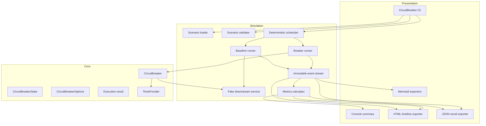
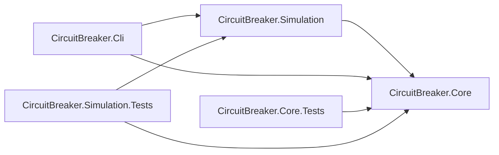
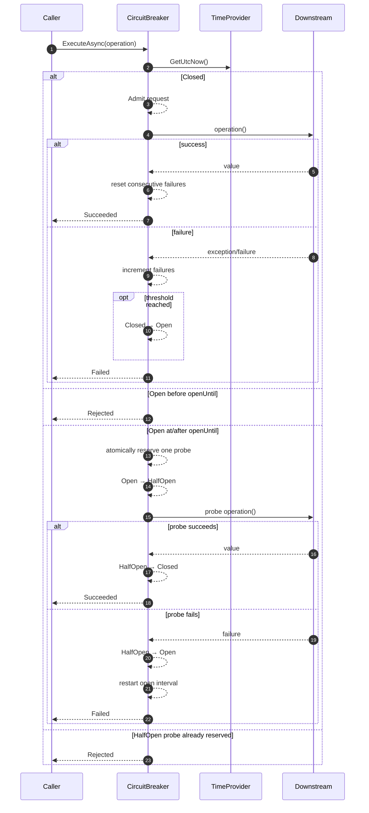
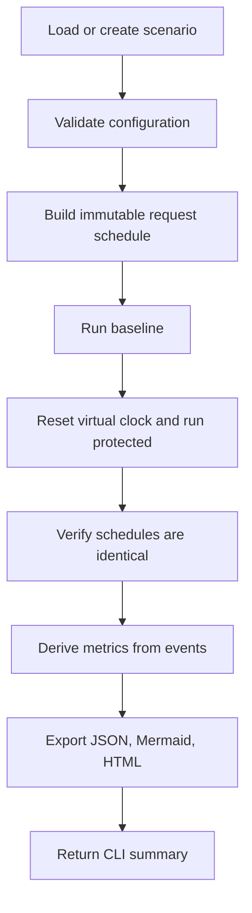
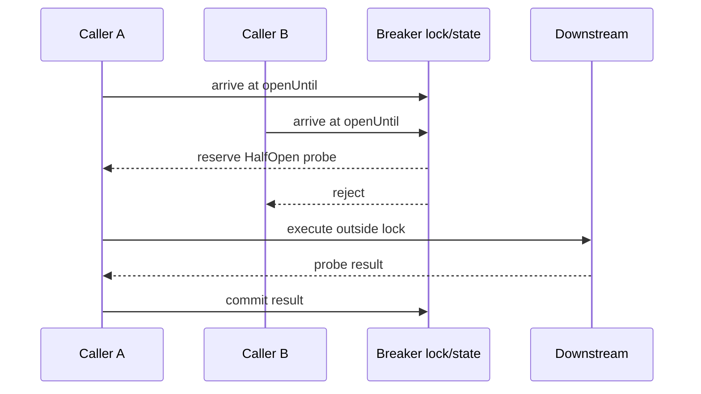

# Architecture

## Component view

## Dependency direction

No arrow may point from Core to Simulation or CLI.

## Protected execution sequence

## Deterministic simulation flow

## Synchronization model

The breaker uses synchronization only to make admission decisions and commit outcomes. User code runs outside the critical section.

## Design rationale

### Why no background timer?

A breaker does not need a timer to mutate itself at the instant the open duration expires. The expiry only changes whether a future call may attempt a probe. A lazy transition therefore avoids timer lifecycle complexity while preserving semantics.

### Why immutable events?

The educational outputs must agree. If console metrics, HTML, and JSON each maintain independent counters they can drift. A single ordered event stream lets all reporting derive from the same facts.

### Why a baseline run?

A circuit breaker's benefit is not merely fewer reported failures. The important engineering effect is fewer expensive calls sent to an already failing dependency. A no-breaker baseline quantifies that avoided load.
