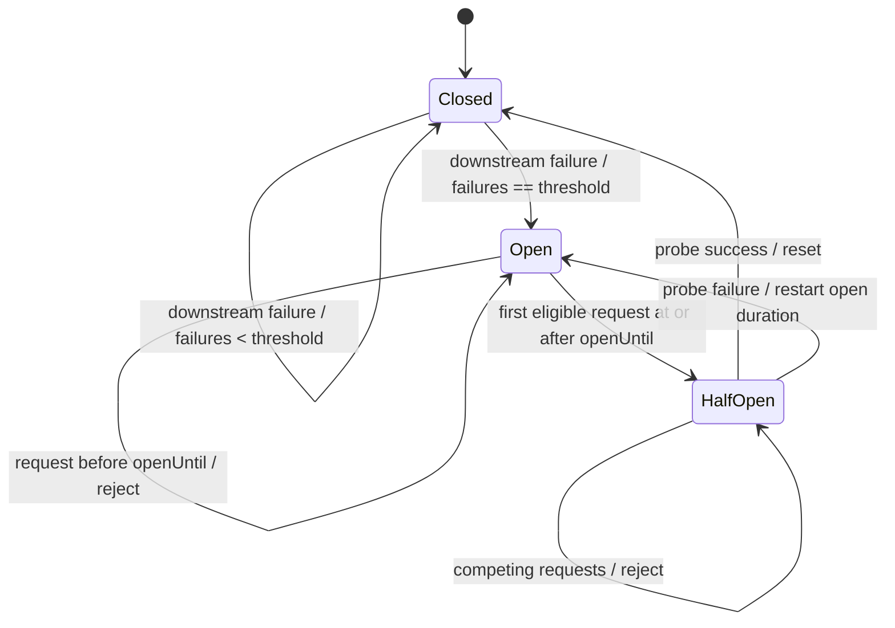

# Domain Model and Invariants

## State model

## Core types

### `CircuitBreakerOptions`

Contains:
- `FailureThreshold`;
- `OpenDuration`.

Validation is eager. Invalid breaker instances must not be constructible through normal public APIs.

### `CircuitBreakerSnapshot`

A read-only observation object for diagnostics/tests. It must not expose setters or mutable references.

Suggested fields:
- `State`;
- `ConsecutiveFailures`;
- `OpenedAt`;
- `OpenUntil`;
- `ProbeInFlight`.

### `CircuitBreakerExecutionResult<T>`

Represents the admission and execution outcome.

Required distinctions:
- downstream success;
- downstream failure;
- breaker rejection.

A rejection has `WasAttempted == false`.
A success or failure has `WasAttempted == true`.

## Invariants

### Invariant: initial state

A newly constructed breaker is `Closed`, has zero consecutive failures, and has no probe in flight.

### Invariant: open means fail-fast before eligibility

While `State == Open` and current time is before `OpenUntil`, every request is rejected and the downstream delegate is not invoked.

### Invariant: time does not close the breaker

Advancing time past `OpenUntil` does not itself mutate the breaker to `Closed`. The next eligible call attempts recovery through `HalfOpen`.

### Invariant: exactly one probe

At most one request may be admitted while the breaker is `HalfOpen`.

### Invariant: success in Closed resets failure streak

Consecutive failures count only an uninterrupted sequence of failures observed while Closed.

### Invariant: failed probe restarts the open period

The new `OpenUntil` is calculated from the probe-failure commit time, not the original opening time.

### Invariant: downstream code executes outside synchronization

The breaker never holds its state lock while awaiting or invoking the supplied operation.

### Invariant: rejected calls do not affect failure counters

A rejection is an admission decision, not a downstream observation.

## Boundary semantics

At exactly `now == OpenUntil`, the first racing caller is eligible to reserve the half-open probe.

Availability-window boundaries should use half-open intervals `[start, end)` so adjacent windows are unambiguous.

## Cancellation

Recommended MVP contract:

- if the caller token is already cancelled before admission, throw/return cancellation without changing breaker state;
- if cancellation occurs after downstream invocation begins and is caused by the caller token, propagate cancellation and do not count it as a dependency failure;
- other `OperationCanceledException` instances that are not attributable to the caller token should follow the same classification policy as other downstream failures, or be explicitly documented otherwise.

Codex must implement one consistent policy and tests for it.
