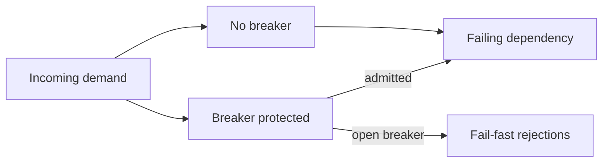

# Metrics

Metrics are derived from immutable run events after simulation completes.

## Per-run metrics

### Requests received

Count of `RequestArrived` events.

### Downstream attempts

Count of requests for which downstream execution actually occurred.

### Successful attempts

Attempted requests completed successfully.

### Failed attempts

Attempted requests observed as dependency failures.

### Rejections

Calls intentionally not sent downstream because breaker admission denied them.

### Breaker openings

Count transitions into `Open` from either `Closed` or `HalfOpen`.

### Half-open probes

Count trial requests admitted in `HalfOpen`.

### Successful and failed probes

Split probe outcomes by downstream result.

## Comparison metrics

### Total downstream calls avoided

```text
baselineAttempts - protectedAttempts
```

### Outage downstream calls avoided

Consider only request timestamps that fall within configured `failing` windows.

```text
baselineOutageAttempts - protectedOutageAttempts
```

### Outage load avoided percentage

```text
(outageAttemptsAvoided / baselineOutageAttempts) * 100
```

If `baselineOutageAttempts == 0`, represent the percentage as unavailable/null.

### Recovery latency

Identify the start of a transition from failing availability to healthy availability. For the relevant recovery event, calculate:

```text
first successful protected request at or after recovery - recovery instant
```

If the service never recovers within the scenario or no successful protected request occurs after recovery, represent recovery latency as unavailable/null.

For a flapping scenario, keep the MVP summary definition simple: report the final recovery latency, and optionally expose per-recovery latency as detailed metrics if straightforward.

## Why failure count alone is insufficient



The engineering benefit is visible in the reduction of admitted work reaching the failing dependency, not simply in how client-visible outcomes are labeled.

## Consistency checks

For each run:
- `received = attempts + rejections`;
- `attempts = successes + failures` for the MVP result model;
- baseline rejections are always zero;
- protected attempts cannot exceed received requests;
- outage attempts avoided cannot be negative when runs share an identical schedule and downstream model.
