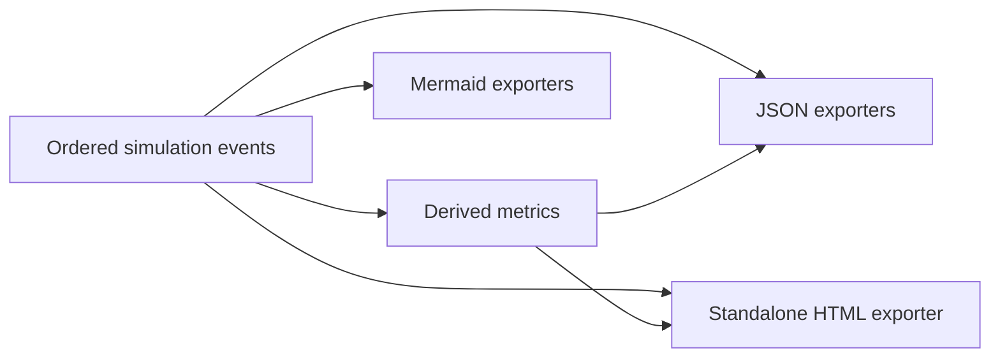

# Reporting

## Artifact flow



## Output directory

Default:

```text
artifacts/<scenario-name>/
```

Required files:
- `baseline.json`;
- `breaker.json`;
- `summary.json`;
- `sequence.mmd`;
- `state-machine.mmd`;
- `timeline.html`.

## Mermaid sequence export

The generated sequence diagram should teach the important behavior without becoming enormous.

Always include:
- the first request that contributes to an opening failure streak;
- the threshold-reaching failure;
- each state transition;
- each half-open probe;
- the final successful recovery when present.

Long sequences of equivalent open-state rejections may be aggregated into a Mermaid `Note` explaining the request count and elapsed range.

Example shape:

```mermaid
sequenceDiagram
    participant Client
    participant Breaker
    participant Downstream

    Client->>Breaker: request
    Breaker->>Downstream: attempt
    Downstream-->>Breaker: failure
    Note over Breaker: threshold reached; Closed → Open

    Client->>Breaker: requests during Open
    Breaker-->>Client: rejected without downstream calls
    Note over Client,Breaker: 9 requests rejected during this interval

    Client->>Breaker: first eligible request
    Note over Breaker: Open → HalfOpen
    Breaker->>Downstream: probe
    Downstream-->>Breaker: success
    Note over Breaker: HalfOpen → Closed
```

## State-machine export

`state-machine.mmd` should be stable/canonical and not scenario-specific except for optional labels showing configured threshold and duration.

## HTML timeline

The HTML report is the primary visualization.

### Required lanes

1. downstream availability;
2. breaker state;
3. request outcomes.

### Required markers

- outage start;
- recovery instant;
- breaker openings;
- half-open probe attempts;
- first successful protected request after recovery.

### Suggested SVG approach

Use a single shared horizontal coordinate transform:

`x = leftPadding + (elapsed / scenarioDuration) * plotWidth`

Availability and breaker states become intervals. Requests become markers at their scheduled timestamps.

### Request marker semantics

Use different shapes as well as styling so the visualization remains understandable without color:
- success: circle;
- attempted failure: X/cross path;
- rejected: small vertical bar or hollow square;
- half-open probe: diamond with success/failure overlay.

### HTML structure

Suggested sections:
- title and scenario description;
- configuration definition list;
- metric cards;
- SVG timeline;
- transition narrative;
- detailed event listing;
- metric definitions;
- generated-at metadata only if it does not break deterministic tests, or omit it by default.

### Deterministic output

Do not include current wall-clock generation timestamps in snapshot-tested artifacts unless tests normalize them. Prefer omitting nondeterministic metadata.
