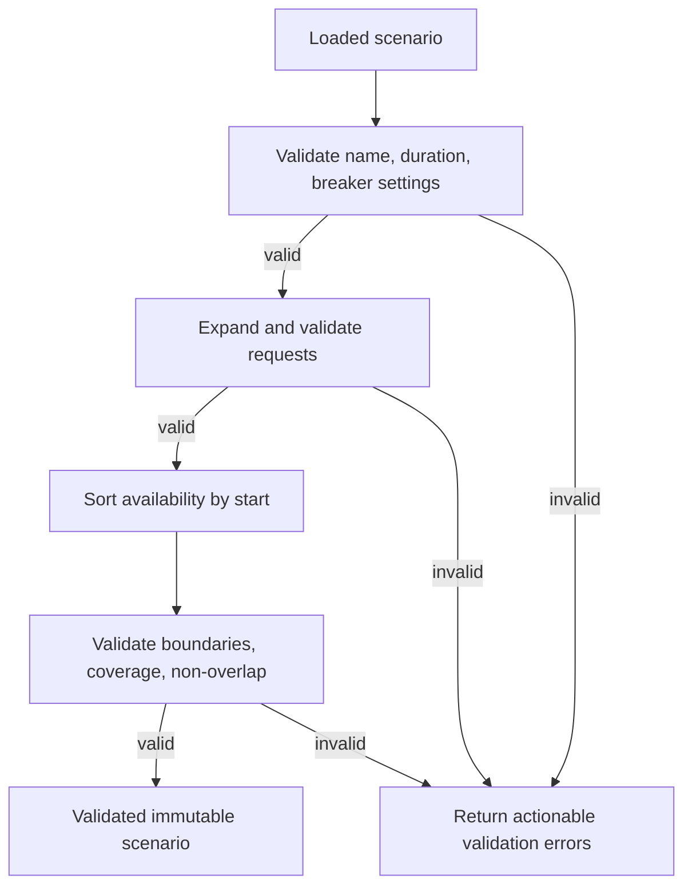

# Scenario Format

Scenarios describe demand and downstream health independently of breaker behavior.

## JSON example

```json
{
  "schemaVersion": 1,
  "name": "long-outage",
  "description": "A sustained outage where the breaker should avoid most failed calls.",
  "duration": "00:01:30",
  "breaker": {
    "failureThreshold": 3,
    "openDuration": "00:00:10"
  },
  "requests": {
    "start": "00:00:00",
    "interval": "00:00:01",
    "count": 90
  },
  "availability": [
    {
      "start": "00:00:00",
      "end": "00:00:10",
      "status": "healthy"
    },
    {
      "start": "00:00:10",
      "end": "00:00:50",
      "status": "failing"
    },
    {
      "start": "00:00:50",
      "end": "00:01:30",
      "status": "healthy"
    }
  ]
}
```

## Request generation

For the MVP, support a compact periodic request generator:
- `start`;
- `interval`;
- `count`.

Internally expand it to immutable request definitions before either run starts. Both baseline and protected simulations consume that exact expanded schedule.

An optional later enhancement may support explicit request timestamps, but it is not necessary for MVP completion.

## Availability semantics

Each availability window is interpreted as `[start, end)`.

Rules:
- windows must be ordered by start time after loading;
- windows must not overlap;
- all window times must fall within scenario duration;
- status is either `healthy` or `failing`;
- gaps are invalid for MVP unless an explicit default status is later introduced.

For maximum clarity, require availability windows to cover the entire scenario duration continuously.

## Built-in scenarios

### `short-outage`

Purpose: show that a breaker can remain open longer than a very brief outage and therefore introduce recovery latency.

Suggested configuration:
- duration 40 seconds;
- requests every second;
- threshold 3;
- open duration 10 seconds;
- healthy 0–10;
- failing 10–15;
- healthy 15–40.

### `long-outage`

Purpose: show substantial avoided downstream load.

Suggested configuration:
- duration 90 seconds;
- requests every second;
- threshold 3;
- open duration 10 seconds;
- healthy 0–10;
- failing 10–50;
- healthy 50–90.

### `failure-before-threshold`

Purpose: prove fewer than threshold consecutive failures do not open the breaker.

### `flapping`

Purpose: show repeated disturbance/recovery and repeated state transitions.

### `failed-half-open-probe`

Purpose: explicitly show `Open → HalfOpen → Open` and restart of the open interval.

### `successful-recovery`

Purpose: show canonical `Open → HalfOpen → Closed` recovery.

## Scenario validation flow


