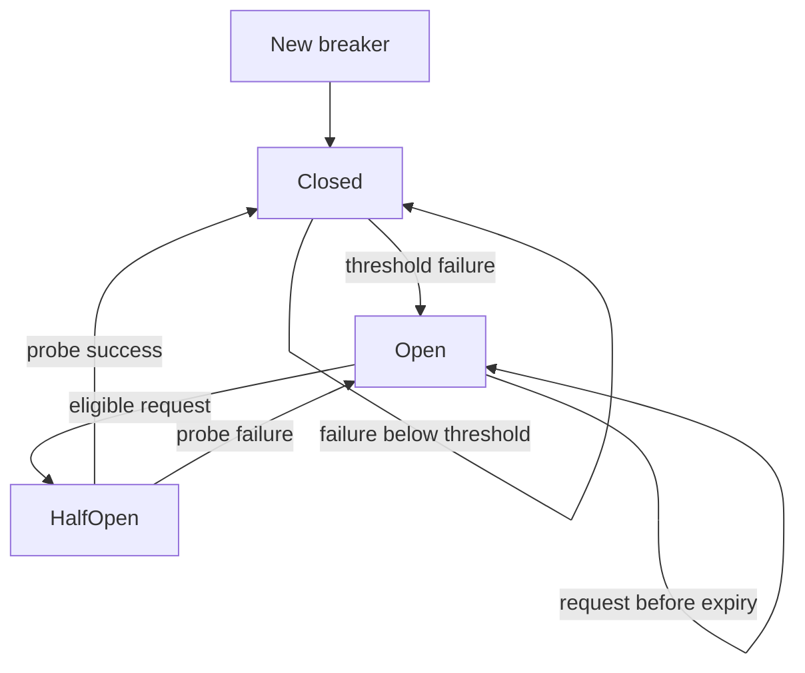
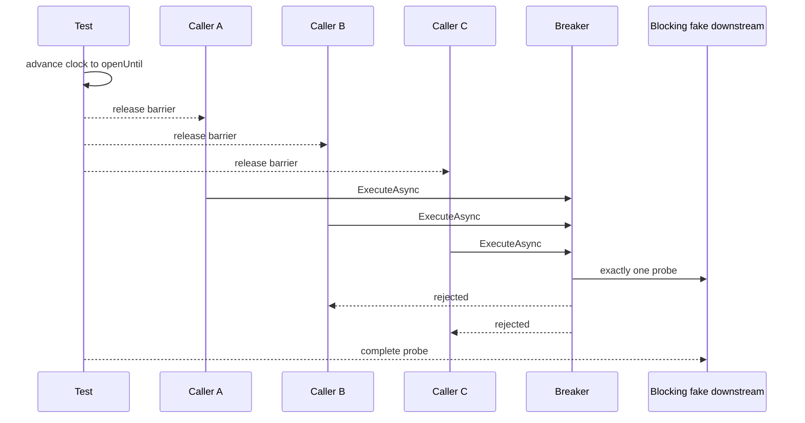

# Testing Strategy

## Principles

- No `Thread.Sleep`.
- No real `Task.Delay` for timing assertions.
- No random availability.
- No test that depends on machine speed.
- Force concurrency using coordination primitives.
- Prefer exact state/event assertions over loose timing tolerances.

## Core state tests



Required behaviors:
- starts closed;
- success in closed resets failure count;
- non-consecutive failures do not trip;
- threshold failure opens;
- rejection does not invoke delegate;
- exact `openUntil` boundary permits one probe;
- probe success closes;
- probe failure reopens;
- failed probe computes a new open interval from failure time;
- rejected calls do not change counters;
- snapshot is internally consistent.

## Half-open race test

Coordinate multiple tasks so they all attempt at the same logical boundary.



The assertion is semantic: exactly one downstream probe invocation and all remaining racing calls rejected. Do not assert which caller wins.

## Simulation tests

### Schedule identity

Assert baseline and protected runs use identical ordered `(requestId, scheduledAt)` sequences.

### Determinism

Run the same validated scenario twice from the same virtual start time and compare normalized result objects/event sequences for equality.

### Availability boundaries

Verify `[start, end)` semantics, especially at exact transition instants.

### Metrics fixtures

Create tiny scenarios whose metrics are easy to calculate manually. Assert exact values for attempts, failures, rejections, openings, probes, avoided calls, and recovery latency.

### Reporting tests

Verify:
- all required files are generated;
- JSON deserializes and reports expected schema version;
- Mermaid files contain expected participants/state transitions;
- HTML contains all required lane labels and embedded SVG;
- no external `http://` or `https://` dependency is present in generated HTML;
- repeated generation yields byte-identical output when inputs are identical.

## Negative tests

Reject scenarios with:
- failure threshold less than one;
- zero/negative open duration;
- zero/negative request interval;
- request schedule beyond duration;
- overlapping availability windows;
- gaps if full coverage is required;
- unsupported availability status;
- malformed `TimeSpan` values;
- duplicate scenario/request identifiers where applicable.

## Quality commands

```bash
dotnet test circuit-breaker-state-machine.slnx -c Release
```

Optionally collect coverage if a coverage package is added, but coverage tooling is not an MVP requirement. Correct boundary and concurrency tests are more important than a numeric coverage target.
